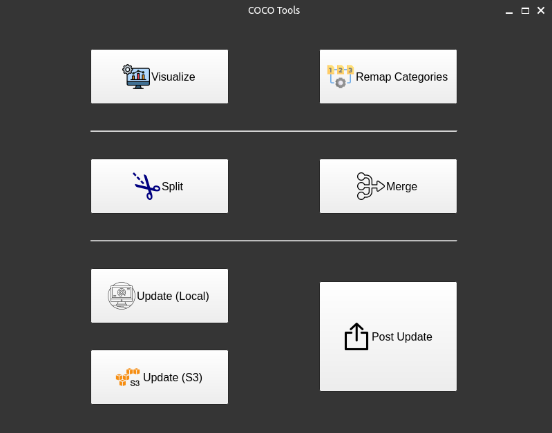

# cvOps

cvOps provides an intuitive Graphical User Interface (GUI) for the streamlined management of COCO datasets. Utilizing the versatility of PyQt5, it stands as an essential toolkit for researchers and developers focused on machine learning and computer vision, simplifying critical tasks such as visualizing, merging, splitting, updating, and post-updating COCO datasets.

## Features

- **Visualize Annotations**: Offers tools for visualizing bounding boxes and segmentation masks from COCO annotations directly within the GUI.
- **Merge Datasets**: Capable of combining multiple COCO datasets into a single comprehensive dataset by merging both images and annotations.
- **Split Dataset**: Supports the division of a COCO dataset into distinct training and validation sets based on a customizable split ratio.
- **Update Dataset**: Facilitates the integration of new images and annotations into existing datasets, aiding in their ongoing refinement and expansion. **It includes all Merge and Split**
- **Post Update Dataset**: Provides functionalities for rearranging and optimizing datasets post-update, ensuring the integrity and effectiveness of the dataset structure.
  - Handling COCO-based computer vision projects of S3

## Post Update Directory Structure

After performing the post-update process, the dataset will adhere to a standardized directory structure:

```
/
|-train_images/
|-val_images/
|-train.json
|-val.json
```

This structure organizes training and validation images into separate folders (`train_images`, `val_images`), with corresponding annotation files (`train.json`, `val.json`) located in the root dataset directory. This clear and efficient organization facilitates easy access and dataset management, crucial for training machine learning models effectively.

Only then, you can use S3 Update function. (Directly update project on AWS S3 bucket.)
For this, `config/s3_credentials.yaml` is required.

```yaml
aws_secret_access_key: {aws_secret_access_key}
aws_access_key_id: {aws_access_key_id} 
```


## Getting Started

0. **Install**: 
   ```bash
  pip install -e .
   ```

1. **Launch**: Activate the COCO Tools GUI by executing the accompanying script.

    ```bash
    python3 cvops/gui_coco_operation.py
    ```

2. **Usage**:
    - The main interface presents options for Visualization, Merging, Splitting, Updating, and Post Updating of datasets.
    - **Visualize**: To visualize, choose the "Visualize" button. Select an image directory and the corresponding COCO annotation file for viewing bounding boxes or segmentation masks.
    - **Merge**: For merging datasets, indicate the image and annotation directories of the datasets to be combined. Specify if the image sets should also be merged.
    - **Split**: Splitting a dataset requires providing an annotation file and image directory, along with specifying the split ratio for training set allocation.
    - **Update**: To run through Merge and Split in one-shot, select new annotations, and specify existing training and validation annotation files along with a new image location. Define the split ratio for new data incorporation.
    - **S3 Update**: Run every update job by downloading artifacts from S3. You only need to set up S3 URI. Tip: Directly click the `Copy S3 URI` from the web interface.
    - **Post Update**: Execute post-update operations by choosing directories for new and existing samples. This ensures the dataset is optimized and organized according to the standard structure post-update. After checking the quality, you have an option to directly upload your updated project into S3.




## Contributing

We welcome and encourage contributions! Fork the repository and submit pull requests to propose new features or enhancements to the cvOps GUI tool, aiming to improve its utility in managing COCO datasets more efficiently and effectively.